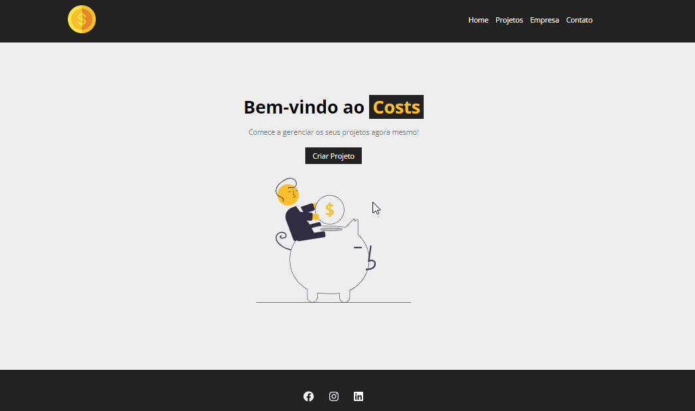

# Costs
- O Costs é um Gerenciador de Projetos e Serviços construído utilizando ReactJS. Nele, é possível ler, adicionar, atualizar e excluir projetos e seus respectivos serviços.
- O projeto possui validação de orçamento e custo, de maneira que não seja possível adicionar serviços com valores mais altos do que o orçamento permite. 
- Também simulamos uma API REST utilizando o [json-server](https://www.npmjs.com/package/json-server), a fim de simular um Banco de Dados utilizando um arquivo JSON.

Principais tópicos abordados no projeto: 
- Fundamentos do React
- JSX
- Componentização
- CSS com React (Component, CSS Modules, global CSS);
- Formulários com React (Hooks, tratamento de eventos, validações, envio para API);
- Requisições HTTP com React (Como enviar e receber dados de uma API);

